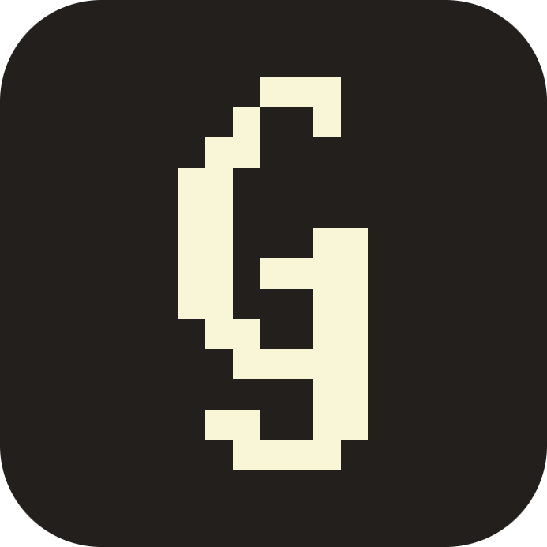
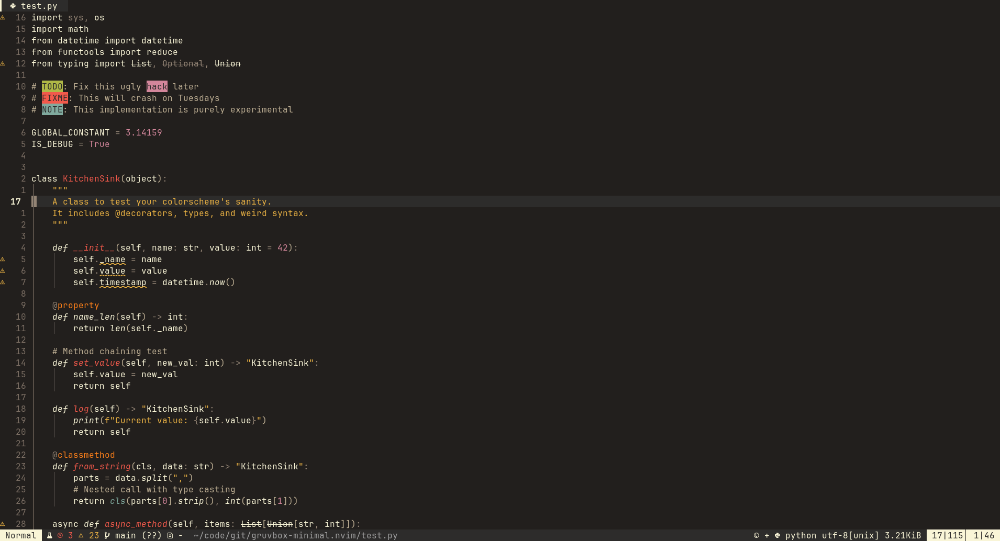
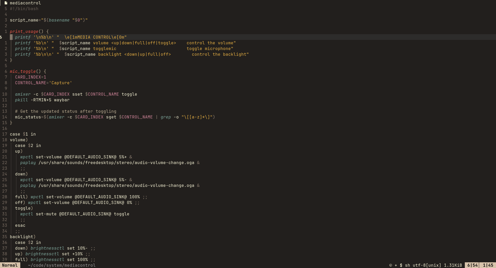
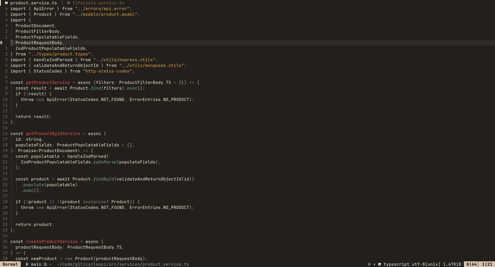

<p align="center">
    </h1>
</p>

<p align="center">
    <strong>Gruvbox Minimal</strong>
</p>

<p align="center">
    A <a href="https://github.com/sainnhe/gruvbox-material">Gruvbox Material</a> theme conceptually inspired by <a href="https://github.com/tonsky/sublime-scheme-alabaster">Alabaster</a>.
</p>

## Preview

</h1>

<details><summary>More previews</summary>
</h1>
</h1>
</details>

## Configuration

The default configuration settings are as follows:

```lua
require("gruvbox-minimal").setup({
	transparent = false, -- Sets all the major background values to 'none'
	italic_comments = false, -- Italic comments
})
```

## Usage

```lua
vim.cmd.colorscheme('gruvbox-minimal')
```

## Configuration

Two config options are provided:

- `g:gruvbox_minimal_dim_comments` (default: `false`). When true, comments are dimmed instead of being highlighteed bright yellow.
- `g:gruvbox_minimal_transparent_bg` (default: `false`). When true, all the background values are set to `none`.
- `g:gruvbox_minimal_floatborder` (default: `false`).
  When true, floating window borders have a foreground colour and background colour is the same as `Normal`.
  When false, floating window borders have no foreground colour and background colour is the same as popup menus.

## Themed plugins

- [mini.nvim](https://github.com/nvim-mini/mini.nvim)
- [MeanderingProgrammer/render-markdown.nvim](https://github.com/MeanderingProgrammer/render-markdown.nvim)
- [shellRaining/hlchunk.nvim](https://github.com/shellRaining/hlchunk.nvim)
